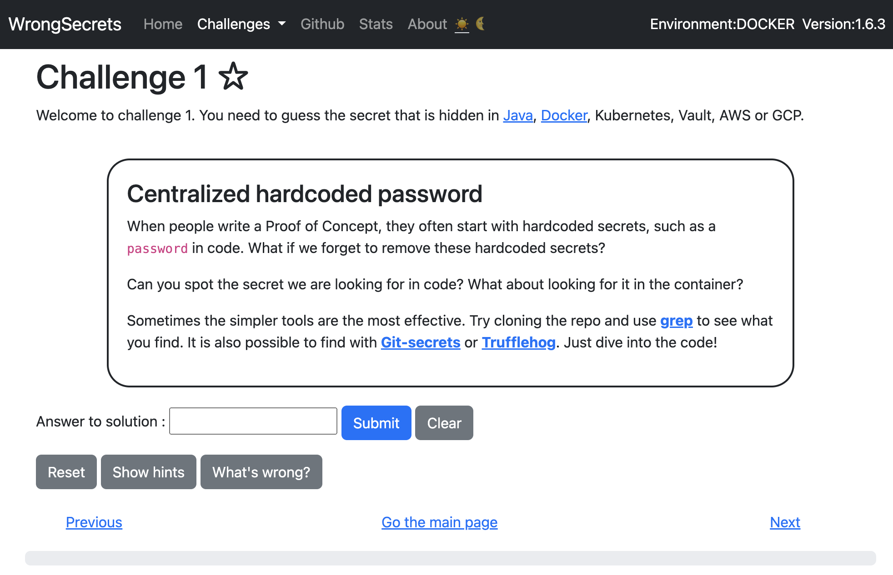

#  Beginner's Guide

---
### Table of Contents
-   [About the Project](#OWASP-WrongSecrets)
-   [Things you need to know](#What-are-the-things-you-need-to-know)
-   [Prerequisites](#Prerequisites)
-   [Pictorial Guide](#How-to-get-started-with-the-project-in-IntelliJ-IDEA)

---
## OWASP WrongSecrets

Basically, [*WrongSecrets*](https://owasp.org/www-project-wrongsecrets/) is an application which teaches how to not store secrets by offering challenges to the user, which helps the user to Self-reflect and correct those mistakes.

---

### What are the things you need to know?

Don’t worry too much if you do not understand the code just reach out to the community in [*#project-wrongsecrets*](https://app.slack.com/client/T04T40NHX/C02KQ7D9XHR) slack, they’ll help you for sure.
Here is some basic Glossary.

1. **Secrets:**  
   [*Secrets*](https://delinea.com/what-is/application-secrets) are the private piece of information just like passwords that protect you private and sensitive information.

2. **Maven**  
   [*Maven*](https://maven.apache.org/what-is-maven.html) is tool of automation mainly used for Java-based projects, which helps to download dependencies and helps get the right **JAR** files for each project.  
   **JAR** stands for **J**ava **AR**chive. Basically, a ZIP file format.

3. **POM- Project Object Model**  
   [*POM*](https://maven.apache.org/guides/introduction/introduction-to-the-pom.html#:~:text=Available%20Variables-,What%20is%20a%20POM%3F,default%20values%20for%20most%20projects.) is basically a design pattern and fundamental unit of work in maven. It is an **XML** file that contains configuration details and other information about the project.

4. **XML**  
   [*XML*](https://en.wikipedia.org/wiki/XML) is a markup language that gives rules to define any data. It **cannot** perform computing operations by itself. So, It relies on other programming languages for data management.

5. **Spring Boot**  
   [*Spring boot*](https://spring.io/projects/spring-boot) is an Java-based open-source framework used for the purpose of micro-Service. Basically, It helps developers create **Standalone** applications that run on their own, without relying on an external web server.

6. **Lombok**  
   [*Lombok*](https://projectlombok.org/) is a project aims in replacing Java code that is repetitive by providing various annotations.

For further information please refer [*OWASP Cheat Sheet*](https://cheatsheetseries.owasp.org/Glossary.html)

---

## Prerequisites

1. **Docker**  
   [*Docker*](https://www.docker.com/) is a software platform that allows you to build, test, and deploy applications quickly and in a more efficient manner.

2. **Node.Js**  
   [*Node.Js*](https://nodejs.org/en/) is an open-source library and a cross-platform JavaScript **runtime environment** specifically for running web applications outside one's browser.

3. **JDK-19**  
   [*JDK*](https://www.oracle.com/java/technologies/javase/jdk19-archive-downloads.html) is a tool used in development and testing programs written in the Java programming language.

3. **IntelliJ IDEA**  
   [*IntelliJ IDEA*](https://www.jetbrains.com/idea/download/#section=windows) is an integrated development environment basically an **IDE** written in Java for developing software written in Java, Kotlin, Groovy etc.

4. **GitHub Desktop**  
   [*GitHub Desktop*](https://desktop.github.com/) is an application that enables you to interact with GitHub using a **GUI** instead of the command line or a web browser.     
   (*Not Mandatory but is recommended for beginners*)

---

## How to get started with the project in IntelliJ IDEA

- ### Step 1: Fork the Project.
  Navigate to the landing page of the repository in your web browser and click on the ***Fork*** button on the repository’s home page.  
  A forked copy of that Git repository will be added to your personal GitHub.  
  

- ### Step 2: Clone the Project.
  A **clone** is a full copy of a repository, including all logging and versions of files.  
  To ***clone*** the Project to your local desktop by clicking on the button as shown below.  
  

- ### Step 3: Open the Project using IntelliJ IDEA
    - ***Open*** the Cloned Project using IntelliJ IDEA by clicking on the button as shown below.  
      

    - **Wait** till the Project Loads.  
      

- ### Step 4: Setup.
    - Open Settings by pressing ***Ctrl+Alt+S***  
      

    - Follow the path ***IDE settings>Language & Frameworks > Lombok*** and then click on ***Lombok.***  
      

    - Make sure that the ***Lombok processing*** is enabled.  
      

- ### Step 5: Reload the project
    - Open the ***Maven*** Tab  
      

    - Press the ***Reload*** button as shown below and allow the project to Reload.   
      

- ### Step 6: Running the Project.
    - Open the ***WrongSecretsApplication*** by following the path ***main>java>org.owasp.wrongsecrets>WrongSecretApplication***.  
      
    - Press ***Shift+F10*** to run the application, this will open up the ***Run/Debug Configurations Menu.***  
      

- ### Step 7: Setting up Configurations.
    -  Select ***Edit configuration templates*** then select ***Application*** section.  
       
    - There under the ***Application*** section click on the button shown below.  
      
    - ***Select*** all the fields that are Selected in the below picture.  
      
    - ***Fill*** all the fields as shown below.   
      
    - Again press ***Shift+F10*** which runs the Application.  
      

- ### There you have it, ***WrongSecrets*** running successfully.
    - Here is a *preview* on how does it look after successfully running the Application.  
      **Note:** Running the Application doesn't open any kind of ***GUI***, it only initializes the ***local webserver*** that you can open via a ***browser.***  
      

    - Here is the preview of the **web server**,  you can try to find the secrets by means of solving the challenge offered at:
      [**Challenges**](https://github.com/OWASP/wrongsecrets#basic-docker-exercises)
      
      ### Since, now you have a running application, you can try [*Contributing*](https://github.com/OWASP/wrongsecrets/blob/master/CONTRIBUTING.md) and try adding [*New challenges.*](https://github.com/OWASP/wrongsecrets#how-to-add-a-challenge)

---
