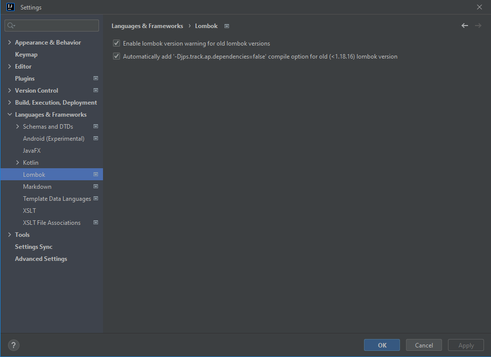
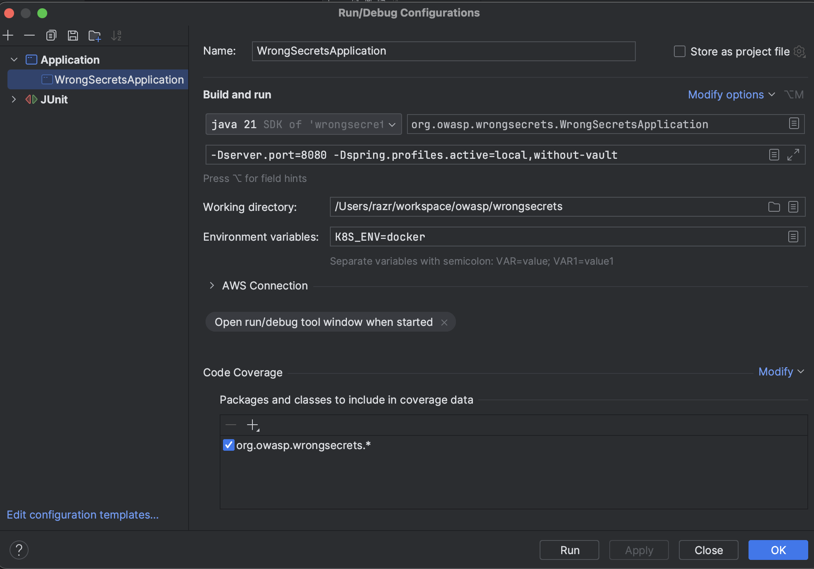

# Contributing

[](https://github.com/OWASP/wrongsecrets/graphs/contributors)


This document describes how you can contribute to WrongSecrets. Please read it carefully.

**Table of Contents**

-   [How to Contribute to the Project](#how-to-contribute-to-the-project)
-   [How to set up your Contributor Environment](#how-to-set-up-your-contributor-environment)
-   [How to get your PR Accepted](#how-to-get-your-pr-accepted)
-   [Beginner Guide](#beginner-guide)
    -   [About the Project](#OWASP-WrongSecrets)
    -   [Prerequisites](#Prerequisites)
    -   [Pictorial Guide on how to get started with the project in IntelliJ IDEA](#How-to-get-started-with-the-project-in-IntelliJ-IDEA)
-   [How to add a Challenge](#how-to-add-a-challenge)

## How to Contribute to the project

There are a couple of ways on how you can contribute to the project:

-   **File [issues](https://github.com/OWASP/wrongsecrets/issues "WrongSecret Issues")** for missing content or errors. Explain what you think is missing and give a suggestion as to where it could be added.
-   **Create a [pull request (PR)](https://github.com/OWASP/wrongsecrets/pulls "Create a pull request")**. This is a direct contribution to the project and may be merged after review. You should ideally [create an issue](https://github.com/OWASP/wrongsecrets/issues "WrongSecret Issues") for any PR you would like to submit, as we can first review the merit of the PR and avoid any unnecessary work. This is of course not needed for small modifications such as correcting typos.
-   **Promote us by giving us a Star or share information via social media**.

## How to get your PR accepted

Your PR is valuable to us, and to make sure we can integrate it smoothly, we have a few items for you to consider. In short:
The minimum requirements for code contributions are:

1. The code _must_ be compliant with the configured pre-commit hooks, and Checkstyle and PMD rules.
2. All new and changed code _should_ have a corresponding unit and/or integration test.
3. New and changed lessons _must_ have a corresponding integration test.
4. [Status checks](https://docs.github.com/en/github/collaborating-with-pull-requests/collaborating-on-repositories-with-code-quality-features/about-status-checks) should pass for your last commit.

Additionally, the following guidelines can help:

### Keep your pull requests limited to a single issue

Pull requests should be as small/atomic as possible. Large, wide-sweeping changes in a pull request will be **rejected**, with comments to isolate the specific code in your pull request. Some examples:

-   If you are making spelling corrections in the docs, don't modify other files.
-   If you are adding new functions don't '_cleanup_' unrelated functions. That cleanup belongs in another pull request.

### Write a good commit message

-   Make sure your commit message passes the [conventional commit standards](https://www.conventionalcommits.org/en/v1.0.0/)
-   Explain why you make the changes. [More info about a good commit message.](https://betterprogramming.pub/stop-writing-bad-commit-messages-8df79517177d)
-   If you fix an issue with your commit, please close the issue by [adding one of the keywords and the issue number](https://docs.github.com/en/issues/tracking-your-work-with-issues/linking-a-pull-request-to-an-issue) to your commit message.

    For example: `Fix #545` or `Closes #10`

## How to set up your Contributor Environment

1. Create a GitHub account. Multiple different GitHub subscription plans are available, but you only need a free one. Follow [these steps](https://help.github.com/en/articles/signing-up-for-a-new-github-account "Signing up for a new GitHub account") to set up your account.
2. Fork the repository. Creating a fork means creating a copy of the repository on your own account, which you can modify without any impact on this repository. GitHub has an [article that describes all the needed steps](https://help.github.com/en/articles/fork-a-repo "Fork a repo").
3. Clone your own repository to your host computer so that you can make modifications. If you followed the GitHub tutorial from step 2, you have already done this.
4. Go to the newly cloned directory "wrongsecrets" and add the remote upstream repository:

    ```bash
    $ git remote -v
    origin git@github.com:<your Github handle>/wrongsecrets.git (fetch)
    origin git@github.com:<your Github handle>/wrongsecrets.git (push)

    $ git remote add upstream git@github.com:OWASP/wrongsecrets.git

    $ git remote -v
    origin git@github.com:<your Github handle>/wrongsecrets.git (fetch)
    origin git@github.com:<your Github handle>/wrongsecrets.git (push)
    upstream git@github.com:OWASP/wrongsecrets.git (fetch)
    upstream git@github.com:OWASP/wrongsecrets.git (push)
    ```

    See also the GitHub documentation on "[Configuring a remote for a fork](https://docs.github.com/en/free-pro-team@latest/github/collaborating-with-issues-and-pull-requests/configuring-a-remote-for-a-fork "Configuring a remote for a fork")".

5. Choose what to work on, based on any of the outstanding [issues](https://github.com/OWASP/wrongsecrets/issues "WrongSecrets Issues").
6. Create a branch so that you can cleanly work on the chosen issue: `git checkout -b fix/Issue66`
7. Open your favorite editor and start making modifications. We recommend using the [IntelliJ Idea](https://www.jetbrains.com/idea/).
8. Install [pre-commit](https://pre-commit.com/#install) the dependencies for our pre-commit configuration to make sure your code complies with standards used in the project. This requires terraform, [terraform-docs](https://github.com/terraform-docs/terraform-docs#installation), [tflint](https://github.com/terraform-linters/tflint#installation), and [commitlint](https://commitlint.js.org/#/guides-local-setup). For commitlint, you need [NodeJS 20](https://nodejs.org/en/download/) installed, after which you you can use `npm install` in the root folder of this project.
9. Install the pre-commit hook using `pre-commit install --hook-type commit-msg`. We recommend to run `pre-commit run -a` every so often if you're working on a bigger change.
10. After your modifications are done, push them to your forked repository. This can be done by executing the command `git add MYFILE` for every file you have modified, followed by `git commit -m 'your commit message here'` to commit the modifications and `git push` to push your modifications to GitHub.
11. Create a Pull Request (PR) by going to your fork, <https://github.com/Your_Github_Handle/wrongsecrets> and click on the "New Pull Request" button. The target branch should typically be the Master branch. When submitting a PR, be sure to follow the checklist that is provided in the PR template. The checklist itself will be filled out by the reviewer.
12. If something in your git workflow went wrong (and e.g., the precommit hook CI run failed), check out ["O Shit, Git!?!"](https://ohshitgit.com/) to view tips on editing your historical commit message(s), among others.
13. Your PR will be reviewed and comments may be given. In order to process a comment, simply make modifications to the same branch as before and push them to your repository. GitHub will automatically detect these changes and add them to your existing PR. If pre-commit can auto-fix the issue, it will automatically try to do so by adding a new commit. This new commit can be pulled in with a simple `git pull`, or, if you've already made one or more new commits: `git pull --rebase`.
14. When starting on a new PR in the future, make sure to always keep your local repo up to date:

    ```bash
    git fetch upstream
    git merge upstream/develop
    ```

    See also the following article for further explanation on "[How to Keep a Downstream git Repository Current with Upstream Repository Changes](https://medium.com/sweetmeat/how-to-keep-a-downstream-git-repository-current-with-upstream-repository-changes-10b76fad6d97 "How to Keep a Downstream git Repository Current with Upstream Repository Changes")".

If at any time you want to work on a different issue, you can simply switch to a different branch, as explained in step 5.

> Tip: Don't try to work on too many issues at once though, as it will be a lot more difficult to merge branches the longer they are open.

## What not to do

Although we greatly appreciate any and all contributions to the project, there are a few things that you should take into consideration:

-   The Wrongsecrets project should not be used as a platform for advertisement for commercial tools, companies or individuals. Write-ups should be written with free and open-source tools in mind and commercial tools are typically not accepted, unless as a reference in the security tools section.
-   Unnecessary self-promotion of tools or blog posts is frowned upon. If you have a relation with on of the URLs or tools you are referencing, please state so in the PR so that we can verify that the reference is in line with the rest of the guide.

Please be sure to take a careful look at our [Code of Conduct](https://github.com/OWASP/wrongsecrets/blob/master/CODE_OF_CONDUCT.md) for all the details.

---

# Beginner guide

## OWASP WrongSecrets

[_WrongSecrets_](https://owasp.org/www-project-wrongsecrets/) is an application teaching how to _not_ store secrets by offering challenges to the user, helping the user to Self-reflect and correct those mistakes.

## Prerequisites

1. **Docker**
   [_Docker_](https://www.docker.com/) is a software platform that allows you to build, test, and deploy applications quickly and in a more efficient manner.

2. **Node.Js 20**
   [_Node.Js_](https://nodejs.org/en/) is an open-source library and a cross-platform JavaScript **runtime environment** specifically for running web applications outside one's browser.

3. **JDK-21**
   [_JDK_](https://www.oracle.com/java/technologies/downloads/#java21) is a tool used in development and testing programs written in the Java programming language.

4. **IntelliJ IDEA**
   [_IntelliJ IDEA_](https://www.jetbrains.com/idea/download) is an integrated development environment basically an **IDE** written in Java for developing software written in Java, Kotlin, Groovy etc.

5. **GitHub Desktop**
   [_GitHub Desktop_](https://desktop.github.com/) is an application that enables you to interact with GitHub using a **GUI** instead of the command line or a web browser.
   (_Not Mandatory but is recommended for beginners_)

---

## How to get started with the project in IntelliJ IDEA

### Step 1: Fork the Project.

Navigate to the landing page of the repository in your web browser and click on the **_Fork_** button on the repository’s home page.
A forked copy of that Git repository will be added to your personal GitHub.


### Step 2: Clone the Project.

A **clone** is a full copy of a repository, including all logging and versions of files.
To **_clone_** the Project to your local desktop by clicking on the button as shown below.

 

### Step 3: Open the Project using IntelliJ IDEA
**_Open_** the Cloned Project using IntelliJ IDEA by clicking on the button as shown below.


**Wait** till the Project Loads.


### Step 4: Setup.

Open Settings by pressing **_Ctrl+Alt+S_**


Follow the path **_IDE settings>Language & Frameworks > Lombok_** and then click on **_Lombok._**


Make sure that the **_Lombok processing_** is enabled.



Select **_Plugins > Marketplace_** and type 'google-java-format' and restart IntelliJ to install the plugin.

Open Settings by pressing **_Ctrl+Alt+S_**


Select **_google-java-format Settings_** and click enable.


### Step 5: Project Structure

Open **_File > Project structure _**.

In the tab `Project` make sure that an SDK of version `21` is selected (e.g. `openjdk-21`, `oraclejdk-21` or just `21` depending on which Java JDK variant you installed).

In the tab `SDKs` make sure that an SDK of version `21` is selected.


### Step 6: Reload the project

Open the **_Maven_** Tab


Press the **_Reload_** button as shown below and allow the project to Reload.


Further use the **_OWASP WrongSecrets --> Lifecycle --> install_** step to load all the depedencies

**NOTE:** Indians and other Asia-Pacific countries users may have to use **VPN** if you enounter this exception `org.owasp.dependencycheck.utils.DownloadFailedException: TLS Connection Reset`.

### Step 7: Running the Project.

Open the **_WrongSecretsApplication_** by following the path **_main>java>org.owasp.wrongsecrets>WrongSecretApplication_**.


Press **_Shift+F10_** to run the application, this will open up the **_Run/Debug Configurations Menu._**


### Step 8: Setting up Configurations.

Select **_Edit configuration templates_** then select **_Application_** section.


There under the **_Application_** section click on the button shown below.


**_Select_** all the fields that are Selected in the below picture.


**_Fill out_** all the fields as shown below.



Again press **_Shift+F10_** which runs the Application.


### There you have it, **_WrongSecrets_** running successfully.

Here is a _preview_ on how does it look after successfully running the Application.
**Note:** Running the Application doesn't open any kind of **_GUI_**, it only initializes the **_local webserver_** that you can open via a **_browser._**


Here is the preview of the **web server**, you can try to find the secrets by means of solving the challenge offered at: [**Challenges**](https://github.com/OWASP/wrongsecrets#basic-docker-exercises)


---

## How to add a challenge

### Step 1: Creating a new issue.

First make sure that you have an [Issue](https://github.com/OWASP/wrongsecrets/issues/new) reported for which a challenge is really wanted, or pick an existing issue you want to implement. Make sure the challenge is assigned to you, as others might be working on the challenge.

### Step 2: Adding the challenge.

Add the **new challenge** in this folder `wrongsecrets/src/main/java/org/owasp/wrongsecrets/challenges/`.
These are the things that you have to keep in mind.
-   First and foremost make sure your challenge is coded in **Java**.
-   Don't forget to add your challenge number in `@Order(28)` annotation, **_28_** in my case.
-   Here is an example of a possible Challenge 28:

```java
    package org.owasp.wrongsecrets.challenges.docker;
    import lombok.extern.slf4j.Slf4j;
    import org.owasp.wrongsecrets.RuntimeEnvironment;
    import org.owasp.wrongsecrets.ScoreCard;
    import org.owasp.wrongsecrets.challenges.Challenge;
    import org.owasp.wrongsecrets.challenges.ChallengeTechnology;
    import org.owasp.wrongsecrets.challenges.Spoiler;
    import org.springframework.core.annotation.Order;
    import org.springframework.stereotype.Component;
    import java.util.List;
    /**
    * Describe what your challenge does
    */
    @Slf4j
    @Component
    @Order(28) //make sure this number is the same as your challenge
    public class Challenge28 extends Challenge {
    private final String secret;
    public Challenge28(ScoreCard scoreCard) {
    super(scoreCard);
    secret = "hello world";
    }
    //is this challenge usable in CTF mode?
    @Override
    public boolean canRunInCTFMode() {
    return true;
    }
    //return the plain text secret here
    @Override
    public Spoiler spoiler() {
    return new Spoiler(secret);
    }
    //here you validate if your answer matches the secret
    @Override
    public boolean answerCorrect(String answer) {
    return secret.equals(answer);
    }
    //which runtime can you use to run the challenge on? (You can just use Docker here)
    /**
    * {@inheritDoc}
    */
    @Override
    public List<RuntimeEnvironment.Environment> supportedRuntimeEnvironments() {
    return List.of(RuntimeEnvironment.Environment.DOCKER);
    }
    //set the difficulty: 1=low, 5=very hard
    /**
    * {@inheritDoc}
    * Difficulty: 1.
    */
    @Override
    public int difficulty() {
    return 1;
    }
    //on which tech is this challenge? See ChallengeTechnology.Tech for categories
    /**
    * {@inheritDoc}
    * Secrets based.
    */
    @Override
    public String getTech() {
    return ChallengeTechnology.Tech.SECRETS.id;
    }
    //if you use this in a shared environment and need to adapt it, then return true here.
    @Override
    public boolean isLimittedWhenOnlineHosted() {
    return false;

                }
            }
```
### Step 3: Adding Test File.

Add the **new TestFile** in this folder `wrongsecrets/src/test/java/org/owasp/wrongsecrets/challenges/`. TestFile is required to do **unit testing.**
These are the things that you have to keep in mind.

 Make sure that this file is also of **Java** type.
Here is a unit test for reference:
```java
    package org.owasp.wrongsecrets.challenges.docker;
    import org.assertj.core.api.Assertions;
    import org.junit.jupiter.api.Test;
    import org.junit.jupiter.api.extension.ExtendWith;
    import org.mockito.Mock;
    import org.mockito.Mockito;
    import org.mockito.junit.jupiter.MockitoExtension;
    import org.owasp.wrongsecrets.ScoreCard;
    @ExtendWith(MockitoExtension.class)
    class Challenge28Test {
      @Mock
      private ScoreCard scoreCard;
      @Test
      void rightAnswerShouldSolveChallenge() {
          var challenge = new Challenge28(scoreCard);
          Assertions.assertThat(challenge.solved("wrong answer")).isFalse();
          Assertions.assertThat(challenge.solved(challenge.spoiler().solution())).isTrue();
      }
    }
```
Please note that PRs for new challenges are only accepted when unit tests are added to prove that the challenge works. Normally tests should not immediately leak the actual secret, so leverage the `.spoil()` functionality of your test implementation for this.

### Step 4: Adding explanations, reasons and hints.

Add the explanation for your challenge along with the hints that will help in finding the secret in this folder `wrongsecrets/src/main/resources/explanations/`.
Things to be noted:

- All the possible explanations for your challenge, included with all the hints and reasons should be provided.
- Everything must be in separate **AsciiDoc files**.
- Follow this fashion in naming the file: `challenge<number>.adoc`, `challenge<number>_hint.adoc`, and `challenge<number>_reason.adoc`.

Here is a Explanation for reference:

```adoc
    === Hello world challenge

    Welcome to OWASP WrongSecrets Beginner guide Challenge

    Basically this challenge is there only to demonstrate how to add a challenge in our project and to give you a basic idea on how does things work.

```

refer this block for reasons:

```adoc
    ==== What’s the purpose of this specific challenge?
    With this challenge, we basically aim to help new contributors to better understand the code and encourage them to add new challenges for our end-user.
```

Use this block as refrence for hints:

```adoc
    Your secret is `Hello World`

    Copy this and paste it in the box provided and press "Submit" and you are good to go.

    This challenge is only meant for helping new contributors to add new challenges. Please, have fun with trying more difficult challenges;-).
```

### Step 5: Submitting your PR.
After completing all the above steps, final step is to submit the PR and refer [**Contributing.md**](https://github.com/OWASP/wrongsecrets/blob/master/CONTRIBUTING.md#how-to-get-your-pr-accepted) on how to get your PR accepted.
