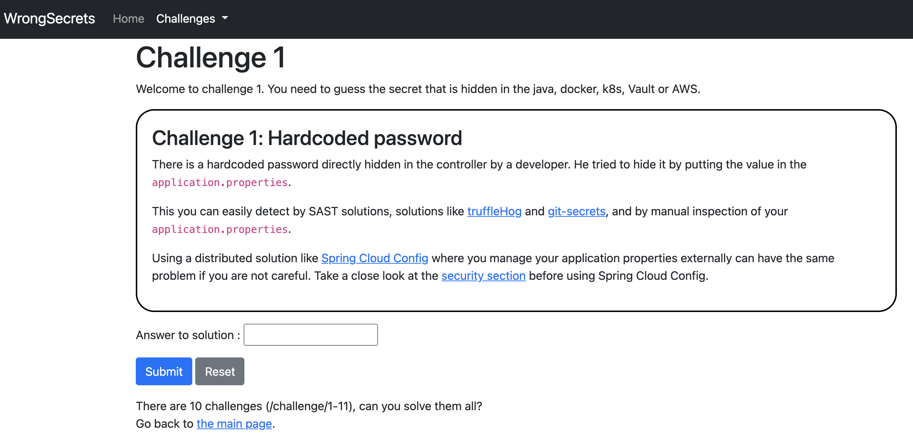

<!-- CRE Link: [223-780](https://www.opencre.org/cre/223-780?register=true&type=tool&tool_type=training&tags=secrets,training&description=With%20this%20app%2C%20we%20have%20packed%20various%20ways%20of%20how%20to%20not%20store%20your%20secrets.%20These%20can%20help%20you%20to%20realize%20whether%20your%20secret%20management%20is%20ok.%20The%20challenge%20is%20to%20find%20all%20the%20different%20secrets%20by%20means%20of%20various%20tools%20and%20techniques.%20Can%20you%20solve%20all%20the%2015%20challenges%3F) -->

# OWASP WrongSecrets [](https://twitter.com/intent/tweet?text=Want%20to%20dive%20into%20secrets%20management%20and%20do%20some%20hunting?%20try%20this&url=https://github.com/commjoen/wrongsecrets&hashtags=secretsmanagement,secrets,hunting,p0wnableapp,OWASP,WrongSecrets)

[](https://github.com/commjoen/wrongsecrets/actions/workflows/main.yml) [](https://github.com/commjoen/wrongsecrets/actions/workflows/terraform.yml) [](https://github.com/commjoen/wrongsecrets/actions/workflows/minikube-k8s-test.yml) [](https://github.com/commjoen/wrongsecrets/actions/workflows/minikube-vault-test.yml) [](https://owasp.org/projects/)[](https://github.com/commjoen/wrongsecrets/discussions)

Welcome to the OWASP WrongSecrets p0wnable app. With this app, we have packed various ways of how to not store your secrets. These can help you to realize whether your secret management is ok. The challenge is to find all the different secrets by means of various tools and techniques.

Can you solve all the 18 challenges?


## Support

Need support? Contact us via [OWASP Slack](https://owasp.slack.com/archives/C02KQ7D9XHR) [for which you sign up here](https://owasp.org/slack/invite), file a [PR](https://github.com/commjoen/wrongsecrets/pulls), file an [issue](https://github.com/commjoen/wrongsecrets/issues) , or use [discussions](https://github.com/commjoen/wrongsecrets/discussions). Please note that this is an OWASP volunteer based project, so it might take a little while before we respond.

## Basic docker exercises

_Can be used for challenges 1-4, 8, 12-18_

For the basic docker exercises you currently require:

- Docker [Install from here](https://docs.docker.com/get-docker/)
- Some Browser that can render HTML

You can install it by doing:

```bash
docker run -p 8080:8080 jeroenwillemsen/wrongsecrets:1.4.3-no-vault
```

Now you can try to find the secrets by means of solving the challenge offered at:

- [localhost:8080/challenge/1](http://localhost:8080/challenge/1)
- [localhost:8080/challenge/2](http://localhost:8080/challenge/2)
- [localhost:8080/challenge/3](http://localhost:8080/challenge/3)
- [localhost:8080/challenge/4](http://localhost:8080/challenge/4)
- [localhost:8080/challenge/8](http://localhost:8080/challenge/8)
- [localhost:8080/challenge/12](http://localhost:8080/challenge/12)
- [localhost:8080/challenge/13](http://localhost:8080/challenge/13)
- [localhost:8080/challenge/14](http://localhost:8080/challenge/14)
- [localhost:8080/challenge/15](http://localhost:8080/challenge/15)
- [localhost:8080/challenge/16](http://localhost:8080/challenge/16)
- [localhost:8080/challenge/17](http://localhost:8080/challenge/17)
- [localhost:8080/challenge/18](http://localhost:8080/challenge/18)

Note that these challenges are still very basic, and so are their explanations. Feel free to file a PR to make them look better ;-).

### Running these on Heroku

You can test them out at [https://wrongsecrets.herokuapp.com/](https://wrongsecrets.herokuapp.com/) as well! But please understand that we have NO guarantees that this works. Given we run in Heroku free-tier, please do not fuzz and/or try to bring it down: you would be spoiling it for others that want to testdrive it.

### Deploying the app under your own heroku account

1. [Sign up to Heroku](https://signup.heroku.com/) and [log in to your account](https://id.heroku.com/login)
2. Click the button below and follow the instructions

[](https://heroku.com/deploy)

## Basic K8s exercise

_Can be used for challenges 1-6, 8, 12-18_

### Minikube based

Make sure you have the following installed:

- Docker [Install from here](https://docs.docker.com/get-docker/)
- Minikube [Install from here](https://minikube.sigs.k8s.io/docs/start/)

The K8S setup currently is based on using Minikube for local fun:

```bash
    minikube start
    kubectl apply -f k8s/secrets-config.yml
    kubectl apply -f k8s/secrets-secret.yml
    kubectl apply -f k8s/secret-challenge-deployment.yml
    while [[ $(kubectl get pods -l app=secret-challenge -o 'jsonpath={..status.conditions[?(@.type=="Ready")].status}') != "True" ]]; do echo "waiting for secret-challenge" && sleep 2; done
    kubectl expose deployment secret-challenge --type=LoadBalancer --port=8080
    minikube service secret-challenge
```

now you can use the provided IP address and port to further play with the K8s variant (instead of localhost).

- [localhost:8080/challenge/5](http://localhost:8080/challenge/5)
- [localhost:8080/challenge/6](http://localhost:8080/challenge/6)

### k8s based

Want to run vanilla on your own k8s? Use the commands below:

```bash
    kubectl apply -f k8s/secrets-config.yml
    kubectl apply -f k8s/secrets-secret.yml
    kubectl apply -f k8s/secret-challenge-deployment.yml
    while [[ $(kubectl get pods -l app=secret-challenge -o 'jsonpath={..status.conditions[?(@.type=="Ready")].status}') != "True" ]]; do echo "waiting for secret-challenge" && sleep 2; done
    kubectl port-forward \
        $(kubectl get pod -l app=secret-challenge -o jsonpath="{.items[0].metadata.name}") \
        8080:8080
```

now you can use the provided IP address and port to further play with the K8s variant (instead of localhost).

- [localhost:8080/challenge/5](http://localhost:8080/challenge/5)
- [localhost:8080/challenge/6](http://localhost:8080/challenge/6)

## Vault exercises with minikube

_Can be used for challenges 1-8, 12-18_
Make sure you have the following installed:

- minikube with docker (or comment out line 8 and work at your own k8s setup),
- docker,
- helm [Install from here](https://helm.sh/docs/intro/install/),
- kubectl [Install from here](https://kubernetes.io/docs/tasks/tools/),
- jq [Install from here](https://stedolan.github.io/jq/download/),
- vault [Install from here](https://www.vaultproject.io/downloads),
- grep, Cat, and Sed

Run `./k8s-vault-minkube-start.sh`, when the script is done, then the challenges will wait for you at <http://localhost:8080> . This will allow you to run challenges 1-8, 12-18.

When you stopped the `k8s-vault-minikube-start.sh` script and want to resume the port forward run: `k8s-vault-minikube-resume.sh`. This is because if you run the start script again it will replace the secret in the vault and not update the secret-challenge application with the new secret.

## Cloud Challenges

_Can be used for challenges 1-18_

**READ THIS**: Given that the exercises below contain IAM privilege escalation exercises, 
never run this on an account which is related to your production environment or can influence your account-over-arching resources.

### Running WrongSecrets in AWS

Follow the steps in [the README in the AWS subfolder](aws/README.md).

### Running WrongSecrets in GCP

Follow the steps in [the README in the GCP subfolder](gcp/README.md).

### Running WrongSecrets in Azure

Follow the steps in [the README in the Azure subfolder](azure/README.md).

### Running Challenge15 in your own cloud only

When you want to include your own Canarytokens for your cloud-deployment, do the following:
1. Fork the project.
2. Make sure you use the [GCP ingress](/gcp/k8s-vault-gcp-ingress-start.sh) or [AWS ingress](aws/k8s-aws-alb-script.sh) scripts to generate an ingress for your project.
3. Go to [canarytokens.org](https://canarytokens.org/generate) and select `AWS Keys`, in the webHook URL field add `<your-domain-created-at-step1>/canaries/tokencallback`.
4. Encrypt the received credentials so that [Challenge15](/src/main/java/org/owasp/wrongsecrets/challenges/docker/Challenge15.java) can decrypt them again.
5. Commit the unencrypted and encrypted materials to Git and then commit again without the decrypted materials.
6. Adapt the hints of Challenge 15 in your fork to point to your fork.
7. Create a container and push it to your registry
8. Override the K8s definition files for either [AWS](/aws/k8s/secret-challenge-vault-deployment.yml) or [GCP](/gcp/k8s/secret-challenge-vault-deployment.yml.tpl).

## Do you want to play without guidance?

Each challenge has a `Show hints` button and a `What's wrong?` button. These buttons help to simplify the challenges and give explanation to the reader. Though, the explanations can spoil the fun if you want to do this as a hacking exercise. Therefore, you can manipulate them by overriding the following settings in your env:

- `hints_enabled=false` will turn off the `Show hints` button.
- `reason_enabled=false` will turn of the `What's wrong?` explanation button.

## Special thanks & Contributors

Leaders:

- [Ben de Haan @bendehaan](https://github.com/bendehaan)
- [Jeroen willemsen @commjoen](https://github.com/commjoen)

Top contributors:

- [Nanne Baars @nbaars](https://github.com/nbaars)
- [Marcin Nowak @MarcinNowak-codes](https://github.com/MarcinNowak-codes)
- [Tibor Hercz @tiborhercz](https://github.com/tiborhercz)
- [Filip Chyla @fchyla](https://github.com/fchyla)
- [Dmitry Litosh @Dlitosh](https://github.com/Dlitosh)
- [Josh Grossman @tghosth](https://github.com/tghosth)
- [Spyros @northdpole](https://github.com/northdpole)
- [Mike Woudenberg @mikewoudenberg](https://github.com/mikewoudenberg)
- [Ruben Kruiver @RubenAtBinx](https://github.com/RubenAtBinx)
- [Finn @f3rn0s](https://github.com/f3rn0s)
- [Joss Sparkes @remakingeden](https://github.com/remakingeden)

Testers:

- [Dave van Stein @davevs](https://github.com/davevs)
- [Marcin Nowak @MarcinNowak-codes](https://github.com/MarcinNowak-codes)
- [Marc Chang Sing Pang @mchangsp](https://github.com/mchangsp)

Special mentions for helping out:

- [Madhu Akula @madhuakula](https://github.com/madhuakula)
- [Björn Kimminich @bkimminich](https://github.com/bkimminich)
- [Avinash Pancham @avinashpancham](https://github.com/avinashpancham)

## Help Wanted

You can help us by the following methods:

- Star us
- Share this app with others
- Of course, we can always use your help [to get more flavors](https://github.com/commjoen/wrongsecrets/issues/37) of "wrongly" configured secrets in to spread awareness! We would love to get some help with other cloudproiders, like Alibabaor Tencent cloud for instance. Do you miss something else than a cloud provider as an example? File an issue or create a PR! See [our guide on contributing for more details](CONTRIBUTING.md). Contributors will be listed in releases, in the "Special thanks & Contributors"-section, and the web-app.

## Use OWASP WrongSecrets as a secret detection benchmark

As tons of secret detection tools are coming up for both Docker and Git, we are creating a Benchmark testbed for it.
Want to know if your tool detects everything? We will keep track of the embedded secrets in [this issue](https://github.com/commjoen/wrongsecrets/issues/201) and have a [branch](https://github.com/commjoen/wrongsecrets/tree/experiment-bed) in which we put additional secrets for your tool to detect.
The branch will contain a Docker container generation script using which you can eventually test your container secret scanning.

## Notes on development

For development on local machine use the `local` profile `./mvnw spring-boot:run -Dspring-boot.run.profiles=local`

If you want to test against vault without K8s: start vault locally with

```shell
 export VAULT_ADDR='http://127.0.0.1:8200'
 export VAULT_API_ADDR='http://127.0.0.1:8200'
 vault server -dev
```

and in your next terminal, do (with the token from the previous commands):

```shell
export VAULT_ADDR='http://127.0.0.1:8200'
export VAULT_TOKEN='<TOKENHERE>'
vault token create -id="00000000-0000-0000-0000-000000000000" -policy="root"
vault kv put secret/secret-challenge vaultpassword.password="$(openssl rand -base64 16)"
```

Now use the `local-vault` profile to do your development.

```shell
./mvnw spring-boot:run -Dspring-boot.run.profiles=local,local-vault
```

If you want to dev without a Vault instance, use additionally the `without-vault` profile to do your development:

```shell
./mvnw spring-boot:run -Dspring-boot.run.profiles=local,without-vault
```

Want to push a container? See `.github/scripts/docker-create-and-push.sh` for a script that generates and pushes all containers. Do not forget to rebuild the app before composing the container

### Dependency management

We have CycloneDX and OWASP Dependency-check integrated to check dependencies for vulnerabilities.
You can use the OWASP Dependency-checker by calling `mvn dependency-check:aggregate` and `mvn cyclonedx:makeBom` to use CycloneDX to create an SBOM.

### Automatic reload during development

To make changes made load faster we added `spring-dev-tools` to the Maven project. To enable this in IntelliJ automatically, make sure:

- Under Compiler -> Automatically build project is enabled, and
- Under Advanced settings -> Allow auto-make to start even if developed application is currently running.

You can also manually invoke: Build -> Recompile the file you just changed, this will also force reloading of the application.

### How to add a Challenge

Follow the steps below on adding a challenge:

1. First make sure that you have an [Issue](https://github.com/commjoen/wrongsecrets/issues) reported for which a challenge is really wanted.
2. Add the new challenge in the `org.owasp.wrongsecrets.challenges` folder. Make sure you add an explanation in `src/main/resources/explanations` and refer to it from your new Challenge class.
3. Add a unit and integration test to show that your challenge is working.
4. Don't forget to add `@Order` annotation to your challenge ;-).

If you want to move existing cloud challenges to another cloud: extend Challenge classes in the `org.owasp.wrongsecrets.challenges.cloud` package and make sure you add the required Terraform in a folder with the separate cloud identified. Make sure that the environment is added to `org.owasp.wrongsecrets.RuntimeEnvironment`. Collaborate with the others at the project to get your container running so you can test at the cloud account.


## Further reading on secrets management

Want to learn more? Checkout the sources below:

- [Blog: 10 Pointers on Secrets Management](https://dev.to/commjoen/secure-deployment-10-pointers-on-secrets-management-187j)
- [OWASP SAMM on Secret Management](https://owaspsamm.org/model/implementation/secure-deployment/stream-b/)
- [The secret detection topic at Github](https://github.com/topics/secrets-detection)
- [OWASP Secretsmanagement Cheatsheet](https://github.com/OWASP/CheatSheetSeries/blob/master/cheatsheets/Secrets_Management_CheatSheet.md)
- [OpenCRE on secrets management](https://www.opencre.org/cre/223-780?register=true&type=tool&tool_type=training&tags=secrets,training&description=With%20this%20app%2C%20we%20have%20packed%20various%20ways%20of%20how%20to%20not%20store%20your%20secrets.%20These%20can%20help%20you%20to%20realize%20whether%20your%20secret%20management%20is%20ok.%20The%20challenge%20is%20to%20find%20all%20the%20different%20secrets%20by%20means%20of%20various%20tools%20and%20techniques.%20Can%20you%20solve%20all%20the%2014%20challenges%3F&trk=flagship-messaging-web&messageThreadUrn=urn:li:messagingThread:2-YmRkNjRkZTMtNjRlYS00OWNiLWI2YmUtMDYwNzY3ZjI1MDcyXzAxMg==&lipi=urn:li:page:d_flagship3_feed;J58Sgd80TdanpKWFMH6z+w==)
